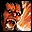
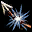

# Навыки и их изменения

### Общее

<table><thead><tr><th width="130">Название</th><th>Изменение</th></tr></thead><tbody><tr><td>
<figure><figcaption>
Noblesse Blessing
</figcaption></figure>
</td><td>Больше не занимает слот баффа.</td></tr><tr><td>
<figure><figcaption>
Heal Over Time
</figcaption></figure>
</td><td>Больше не занимает слот баффа. Изменение так же коснулись схожих эффектов по типу  Greater Healing Potion.</td></tr><tr><td>
<figure><figcaption>
Mana Potion
</figcaption></figure>
</td><td>Восстанавливает 1000 MP, задержка перед применением 3 секунды.</td></tr><tr><td>
<figure><figcaption>
Malaria
</figcaption></figure>
</td><td>Теперь бафф и занимает слот. Аналогичен эффект и для  Flu.</td></tr><tr><td>
<figure><figcaption>
Self
</figcaption></figure>
</td><td>Время действия увеличено до 2 часов <strong>(не работает на Олимпиаде</strong>). Аналогичен эффект для схожих Self </td></tr><tr><td>
<figure><figcaption>
Cancellation
</figcaption></figure>
</td><td>Снятые баффы возвращаются через 10 секунд. Изменение так же коснулись схожих эффектов по типу .</td></tr><tr><td>
<figure><figcaption>
Close Combat
</figcaption></figure>
</td><td>
Увеличивает физический урон в бою с монстрами на 50%/100%
<table data-header-hidden><thead><tr><th></th></tr></thead><tbody><tr><td>Human Fighter, Elven Fighter, Dark Elven Fighter, Dwarven Fighter, Monk, Warlock, Elemental Summoner, Phantom Summoner, Warsmith</td></tr><tr><td>Gladiator, Paladin, Treasure Hunter, Hawkeye, Temple Knight, Sword Singer, Plains Walker, Silver Ranger, Shilen Knight, Blade Dancer, Abyss Walker, Phantom Ranger, Bounty Hunter</td></tr></tbody></table></td></tr><tr><td>
<figure><figcaption>
Close Combat: Servant
</figcaption></figure>
</td><td>
Увеличивает физический урон слуги в бою с монстрами на 50%.
<table data-header-hidden><thead><tr><th>Доступно с 40 уровня для:</th></tr></thead><tbody><tr><td>Dark Avenger, Warlock, Elemental Summoner, Phantom Summoner, Warsmith</td></tr></tbody></table></td></tr><tr><td>
<figure><figcaption>
Magic Balance
</figcaption></figure>
</td><td>Базовый шанс магического крита увеличен, однако урон пропорционально снижен.</td></tr><tr><td>
<figure><figcaption>
Summon CP Potion
</figcaption></figure>
</td><td><mark style="color:$success;">Перезарядка снижена до 5 минут и является статичной.</mark></td></tr></tbody></table>

### Human Mystic

<table><thead><tr><th width="126">Навык</th><th>Изменение</th></tr></thead><tbody><tr><td>
<figure><figcaption>
Silence
</figcaption></figure>
</td><td><mark style="color:red;">Длительность эффекта снижена до 15 секунд.</mark> Аналогичен эффект и для  Curse of Doom.</td></tr><tr><td>
<figure><figcaption>
Anchor
</figcaption></figure>
</td><td><mark style="color:red;">Длительность эффекта снижена до 10 секунд.</mark></td></tr><tr><td>
<figure><figcaption>
Mass Fear
</figcaption></figure>
</td><td><mark style="color:green;">Увеличен шанс прохождения на 10%,</mark> <mark style="color:red;">длительность эффекта снижена до 5 секунд.</mark></td></tr><tr><td>
<figure><figcaption>
Mass Slow
</figcaption></figure>
</td><td><mark style="color:green;">Увеличен шанс прохождения на 10%.</mark></td></tr><tr><td>
<figure><figcaption>
Mass Mage Bane
</figcaption></figure>
</td><td><mark style="color:red;">Снятые баффы возвращаются через 10 секунд.</mark> Аналогичен эффект и для Mass Warrior Bane и  Cancellation.</td></tr><tr><td>
<figure><figcaption>
Curse Diseace
</figcaption></figure>
</td><td><mark style="color:green;">Увеличен шанс прохождения на 10%,</mark> <mark style="color:red;">длительность эффекта снижена до 60 секунд.</mark></td></tr><tr><td>
<figure><figcaption>
Inferno
</figcaption></figure>
</td><td><mark style="color:green;">Больше не требует зарядов, перезарядка снижена до 2 минут и является статичной.</mark></td></tr><tr><td>
<figure><figcaption>
Celestial Shield
</figcaption></figure>
</td><td><mark style="color:red;">Перезарядка повышена до 5 минут и является статичной.</mark></td></tr><tr><td>
<figure><figcaption>
Spell Turning
</figcaption></figure>
</td><td><mark style="color:green;">Перезарядка снижена до 10 секунд</mark> <mark style="color:red;">и является статичной.</mark></td></tr><tr><td>
<figure><figcaption>
World of Fear
</figcaption></figure>
</td><td><mark style="color:green;">Перезарядка снижена до 15 секунд</mark> <mark style="color:red;">и является статичной.</mark></td></tr><tr><td>
<figure><figcaption>
Prominence (Drain PvE Only)
</figcaption></figure>
</td><td>Аналог Prominence, восстанавливает часть здоровья. Нельзя использовать в PvP.</td></tr></tbody></table>

### Human Fighter

<table><thead><tr><th width="125">Навык</th><th>Изменение</th></tr></thead><tbody><tr><td>
<figure><figcaption>
Sonic Barrier
</figcaption></figure>
</td><td><mark style="color:green;">Перезарядка снижена до 5 минут и является статичной.</mark></td></tr><tr><td>
<figure><figcaption>
Sonic Buster
</figcaption></figure>
</td><td><mark style="color:green;">Больше не требует цели.</mark></td></tr><tr><td>
<figure><figcaption>
Lethal Blow
</figcaption></figure>
</td><td><mark style="color:red;">Уменьшен шанс летального исхода.</mark> Аналогичен эффект и для  Backstab.</td></tr><tr><td>
<figure><figcaption>
Shackle
</figcaption></figure>
</td><td><mark style="color:green;">Увеличен шанс прохождения на 10%.</mark></td></tr><tr><td>
<figure><figcaption>
Mass Shackling
</figcaption></figure>
</td><td><mark style="color:green;">Увеличен шанс прохождения на 10%.</mark></td></tr><tr><td>
<figure><figcaption>
Hamstring
</figcaption></figure>
</td><td><mark style="color:green;">Время применения уменьшено на 1 секунду.</mark></td></tr><tr><td>
<figure><figcaption>
Physical Mirror
</figcaption></figure>
</td><td><mark style="color:green;">Увеличен шанс срабатывания  на 10%.</mark></td></tr><tr><td>
<figure><figcaption>
Double Shot (Drain PvE Only)
</figcaption></figure>
</td><td>Аналог Double Shot, восстанавливает часть здоровья. Нельзя использовать в PvP.</td></tr></tbody></table>

### Elven Mystic

<table><thead><tr><th width="125">Навык</th><th>Изменение</th></tr></thead><tbody><tr><td>
<figure><figcaption>
Blizzard
</figcaption></figure>
</td><td><mark style="color:green;">Больше не требует зарядов, перезарядка снижена до 2 минут и является статичной.</mark></td></tr><tr><td>
<figure><figcaption>
Cancellation
</figcaption></figure>
</td><td><mark style="color:red;">Снятые баффы возвращаются через 10 секунд.</mark></td></tr><tr><td>
<figure><figcaption>
Hydro Blast (Drain PvE Only)
</figcaption></figure>
</td><td>Аналог Hydro Blast, восстанавливает часть здоровья. Нельзя использовать в PvP.</td></tr></tbody></table>

### Elven Fighter

<table><thead><tr><th width="125">Навык</th><th>Изменение</th></tr></thead><tbody><tr><td>
<figure><figcaption>
Rapid Fire
</figcaption></figure>
</td><td><mark style="color:green;">Больше не уменьшает дальность стрельбы.</mark></td></tr><tr><td>
<figure><figcaption>
Magic Mirror
</figcaption></figure>
</td><td><mark style="color:green;">Увеличен шанс срабатывания на 10%.</mark></td></tr><tr><td>
<figure><figcaption>
Lethal Blow
</figcaption></figure>
</td><td><mark style="color:red;">Уменьшен шанс летального исхода.</mark> Аналогичен эффект и для  Backstab.</td></tr><tr><td>
<figure><figcaption>
Double Shot (Drain PvE Only)
</figcaption></figure>
</td><td>Аналог Double Shot, восстанавливает часть здоровья. Нельзя использовать в PvP.</td></tr></tbody></table>

### Dark Elven Mage

<table><thead><tr><th width="125">Навык</th><th>Изменение</th></tr></thead><tbody><tr><td>
<figure><figcaption>
Demon Wind
</figcaption></figure>
</td><td><mark style="color:green;">Больше не требует зарядов, перезарядка снижена до 2 минут и является статичной.</mark></td></tr><tr><td>
<figure><figcaption>
Silence
</figcaption></figure>
</td><td><mark style="color:red;">Длительность эффекта снижена до 15 секунд.</mark></td></tr></tbody></table>

### Dark Elven Fighter

<table><thead><tr><th width="125">Навык</th><th>Изменение</th></tr></thead><tbody><tr><td>
<figure><figcaption>
Lethal Blow
</figcaption></figure>
</td><td><mark style="color:red;">Уменьшен шанс летального исхода.</mark> Аналогичен эффект и для  Backstab.</td></tr><tr><td>
<figure><figcaption>
Drain Health
</figcaption></figure>
</td><td><mark style="color:green;">Время применения и перезарядка снижена до 1.5 секунд</mark> и является статичной.</td></tr><tr><td>
<figure><figcaption>
Lightning Strike
</figcaption></figure>
</td><td><mark style="color:green;">Увеличен шанс срабатывания на 10%.</mark></td></tr><tr><td>
<figure><figcaption>
Magical Mirror
</figcaption></figure>
</td><td><mark style="color:green;">Увеличен шанс срабатывания на 10%.</mark></td></tr><tr><td>
<figure><figcaption>
Touch of Death
</figcaption></figure>
</td><td><mark style="color:red;">Снятые баффы возвращаются через 10 секунд.</mark></td></tr><tr><td>
<figure><figcaption>
Double Shot (Drain PvE Only)
</figcaption></figure>
</td><td>Аналог Double Shot, восстанавливает часть здоровья. Нельзя использовать в PvP.</td></tr></tbody></table>

### Orc Mystic

<table><thead><tr><th width="125">Навык</th><th>Изменение</th></tr></thead><tbody><tr><td>
<figure><figcaption>
Seal of Silence
</figcaption></figure>
</td><td><mark style="color:red;">Длительность эффекта снижена до 30 секунд.</mark></td></tr><tr><td>
<figure><figcaption>
Seal of Suspension
</figcaption></figure>
</td><td><mark style="color:red;">Длительность эффекта снижена до 90 секунд.</mark></td></tr><tr><td>
<figure><figcaption>
Seal of Slow
</figcaption></figure>
</td><td><mark style="color:red;">Длительность эффекта снижена до 30 секунд.</mark></td></tr><tr><td>
<figure><figcaption>
Seal of Scougre
</figcaption></figure>
</td><td><mark style="color:red;">Длительность эффекта снижена до 30 секунд.</mark></td></tr><tr><td>
<figure><figcaption>
Pa'agrio Fist
</figcaption></figure>
</td><td><mark style="color:green;">Перезарядка снижена до 10 секунд.</mark></td></tr><tr><td>
<figure><figcaption>
Seal of Disease
</figcaption></figure>
</td><td><mark style="color:red;">Длительность эффекта снижена до 90 секунд.</mark></td></tr></tbody></table>

### Orc Fighter

<table><thead><tr><th width="125">Навык</th><th>Изменение</th></tr></thead><tbody><tr><td>
<figure><figcaption>
Force Barrier
</figcaption></figure>
</td><td><mark style="color:green;">Перезарядка снижена до 5 минут и является статичной.</mark></td></tr></tbody></table>
